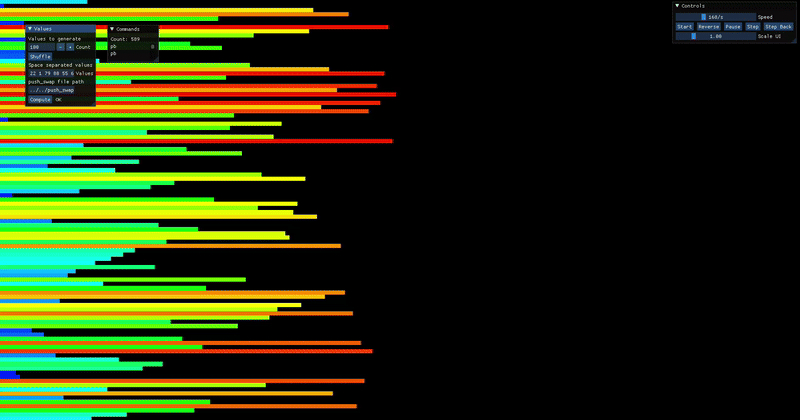

# push_swap - 42 School

Tri une pile (A) vers B puis A triée. Score 100/100. Complexité O(n log n) <500 elems.

 

## Features
- Instructions : sa, sb, pa, pb, ra, rb, rra, rrb, rr, rrr.
- Custom turkish sort.
- No leaks, args safe (dups, int range).

## Installation
```bash
make && ./push_swap 42 12 8 7 4 2 1
